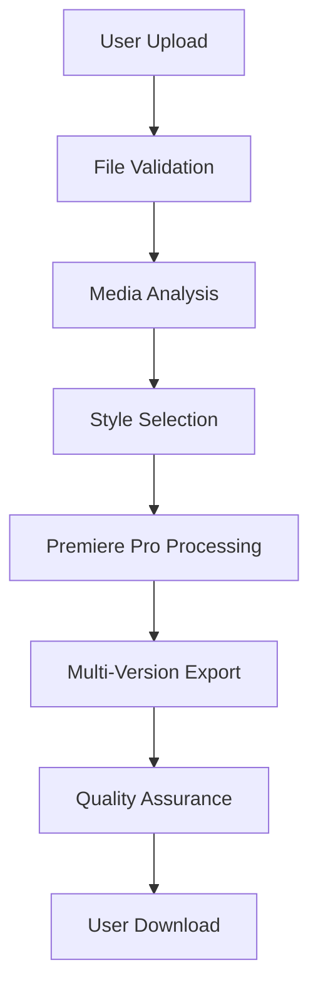

# 🎬 Edit.ai - Technical Roadmap

## 🚀 Technical Architecture Overview

### **Core Technology Stack**
- **Backend**: Node.js + Express.js
- **Frontend**: React.js + TypeScript
- **Database**: PostgreSQL + Redis
- **File Processing**: FFmpeg + Adobe Premiere Pro
- **Automation**: ExtendScript + AppleScript/Windows Script
- **Security**: JWT + bcrypt + encryption
- **Deployment**: Docker + AWS/GCP

---

## 📋 Phase 1: Foundation & Legal Framework

### **1.1 Legal Research & Compliance**

#### **Adobe Premiere Pro Licensing Analysis**
```javascript
// Research Areas:
- Adobe Creative Cloud Developer Agreement
- ExtendScript Usage Rights
- Plugin Development Policies
- Automation Terms of Service
- Commercial Usage Rights
```

#### **Data Privacy & Security Framework**
```javascript
// Compliance Requirements:
- GDPR (EU Users)
- CCPA (California Users)
- Local Data Processing Laws
- User Consent Mechanisms
- Data Retention Policies
- Right to Deletion
```

#### **Intellectual Property Protection**
```javascript
// IP Strategy:
- Trademark "Edit.ai" (Class 9, 42)
- Patent Research for Automation Methods
- Copyright Protection for Style Definitions
- Open Source Licensing Strategy
- Trade Secret Protection
```

### **1.2 Technical Foundation**

#### **System Architecture Design**


#### **Database Schema Design**
```sql
-- Users Table
CREATE TABLE users (
    id UUID PRIMARY KEY,
    email VARCHAR(255) UNIQUE,
    password_hash VARCHAR(255),
    subscription_tier VARCHAR(50),
    created_at TIMESTAMP,
    updated_at TIMESTAMP
);

-- Projects Table
CREATE TABLE projects (
    id UUID PRIMARY KEY,
    user_id UUID REFERENCES users(id),
    name VARCHAR(255),
    status VARCHAR(50),
    original_file_path VARCHAR(500),
    created_at TIMESTAMP,
    updated_at TIMESTAMP
);

-- Exports Table
CREATE TABLE exports (
    id UUID PRIMARY KEY,
    project_id UUID REFERENCES projects(id),
    style_name VARCHAR(100),
    file_path VARCHAR(500),
    quality VARCHAR(50),
    duration INTEGER,
    file_size BIGINT,
    created_at TIMESTAMP
);

-- Styles Table
CREATE TABLE styles (
    id UUID PRIMARY KEY,
    name VARCHAR(100),
    description TEXT,
    config JSONB,
    is_custom BOOLEAN,
    user_id UUID REFERENCES users(id),
    created_at TIMESTAMP
);
```

#### **API Endpoint Planning**
```javascript
// RESTful API Structure
POST   /api/auth/register
POST   /api/auth/login
POST   /api/auth/logout

GET    /api/projects
POST   /api/projects
GET    /api/projects/:id
PUT    /api/projects/:id
DELETE /api/projects/:id

POST   /api/upload
GET    /api/exports
GET    /api/exports/:id
DELETE /api/exports/:id

GET    /api/styles
POST   /api/styles
GET    /api/styles/:id
PUT    /api/styles/:id
DELETE /api/styles/:id

POST   /api/process
GET    /api/process/:id/status
```

### **1.3 Development Environment Setup**

#### **Local Development Environment**
```bash
# Required Software
- Node.js 18+
- PostgreSQL 14+
- Redis 6+
- Adobe Premiere Pro 2024
- FFmpeg
- Docker Desktop

# Development Tools
- VS Code with Extensions
- Postman for API Testing
- pgAdmin for Database Management
- Redis Commander
```

#### **Project Structure**
```
edit-ai/
├── backend/
│   ├── src/
│   │   ├── controllers/
│   │   ├── models/
│   │   ├── services/
│   │   ├── middleware/
│   │   ├── utils/
│   │   └── routes/
│   ├── tests/
│   ├── docs/
│   └── package.json
├── frontend/
│   ├── src/
│   │   ├── components/
│   │   ├── pages/
│   │   ├── services/
│   │   ├── hooks/
│   │   ├── utils/
│   │   └── styles/
│   ├── public/
│   └── package.json
├── scripts/
│   ├── premiere-controller.jsx
│   ├── bridge-controller.js
│   └── media-analyzer.js
├── styles/
│   ├── cinematic.json
│   ├── vlog.json
│   └── corporate.json
├── docs/
├── tests/
└── docker/
```

---

## 🔧 Phase 2: Core Technical Development

### **2.1 Backend Infrastructure**

#### **Node.js Server Development**
```javascript
// Express.js Server Setup
const express = require('express');
const cors = require('cors');
const helmet = require('helmet');
const rateLimit = require('express-rate-limit');

const app = express();

// Security Middleware
app.use(helmet());
app.use(cors({
  origin: process.env.FRONTEND_URL,
  credentials: true
}));

// Rate Limiting
const limiter = rateLimit({
  windowMs: 15 * 60 * 1000, // 15 minutes
  max: 100 // limit each IP to 100 requests per windowMs
});
app.use('/api/', limiter);

// Routes
app.use('/api/auth', authRoutes);
app.use('/api/projects', projectRoutes);
app.use('/api/uploads', uploadRoutes);
app.use('/api/exports', exportRoutes);
app.use('/api/styles', styleRoutes);
app.use('/api/process', processRoutes);
```

#### **File Upload System**
```javascript
// Multer Configuration for File Uploads
const multer = require('multer');
const path = require('path');

const storage = multer.diskStorage({
  destination: (req, file, cb) => {
    const uploadPath = path.join(__dirname, '../uploads/temp');
    cb(null, uploadPath);
  },
  filename: (req, file, cb) => {
    const uniqueSuffix = Date.now() + '-' + Math.round(Math.random() * 1E9);
    cb(null, file.fieldname + '-' + uniqueSuffix + path.extname(file.originalname));
  }
});

const fileFilter = (req, file, cb) => {
  const allowedTypes = ['video/mp4', 'video/mov', 'video/avi', 'audio/mp3', 'audio/wav'];
  if (allowedTypes.includes(file.mimetype)) {
    cb(null, true);
  } else {
    cb(new Error('Invalid file type'), false);
  }
};

const upload = multer({
  storage: storage,
  fileFilter: fileFilter,
  limits: {
    fileSize: 1024 * 1024 * 500 // 500MB limit
  }
});
```

#### **Authentication System**
```javascript
// JWT Authentication
const jwt = require('jsonwebtoken');
const bcrypt = require('bcrypt');

class AuthService {
  async register(userData) {
    const { email, password } = userData;
    
    // Check if user exists
    const existingUser = await User.findOne({ where: { email } });
    if (existingUser) {
      throw new Error('User already exists');
    }
    
    // Hash password
    const saltRounds = 12;
    const hashedPassword = await bcrypt.hash(password, saltRounds);
    
    // Create user
    const user = await User.create({
      email,
      password_hash: hashedPassword,
      subscription_tier: 'free'
    });
    
    // Generate JWT token
    const token = jwt.sign(
      { userId: user.id, email: user.email },
      process.env.JWT_SECRET,
      { expiresIn: '24h' }
    );
    
    return { user, token };
  }
  
  async login(credentials) {
    const { email, password } = credentials;
    
    // Find user
    const user = await User.findOne({ where: { email } });
    if (!user) {
      throw new Error('Invalid credentials');
    }
    
    // Verify password
    const isValidPassword = await bcrypt.compare(password, user.password_hash);
    if (!isValidPassword) {
      throw new Error('Invalid credentials');
    }
    
    // Generate JWT token
    const token = jwt.sign(
      { userId: user.id, email: user.email },
      process.env.JWT_SECRET,
      { expiresIn: '24h' }
    );
    
    return { user, token };
  }
}
```

### **2.2 Media Analysis System**

#### **Video Analysis Engine**
```javascript
// FFmpeg Integration for Video Analysis
const ffmpeg = require('fluent-ffmpeg');
const { promisify } = require('util');

class MediaAnalyzer {
  async analyzeVideo(filePath) {
    return new Promise((resolve, reject) => {
      ffmpeg.ffprobe(filePath, (err, metadata) => {
        if (err) {
          reject(err);
          return;
        }
        
        const analysis = {
          duration: metadata.format.duration,
          size: metadata.format.size,
          bitrate: metadata.format.bit_rate,
          format: metadata.format.format_name,
          streams: metadata.streams.map(stream => ({
            type: stream.codec_type,
            codec: stream.codec_name,
            width: stream.width,
            height: stream.height,
            fps: stream.r_frame_rate
          }))
        };
        
        resolve(analysis);
      });
    });
  }
  
  async extractAudioWaveform(filePath) {
    return new Promise((resolve, reject) => {
      const waveform = [];
      
      ffmpeg(filePath)
        .audioFilters('aresample=8000')
        .outputFormat('wav')
        .on('end', () => resolve(waveform))
        .on('error', reject)
        .pipe();
    });
  }
  
  async detectScenes(filePath) {
    return new Promise((resolve, reject) => {
      const scenes = [];
      
      ffmpeg(filePath)
        .videoFilters('select=gt(scene\\,0.4),showinfo')
        .outputFormat('null')
        .on('end', () => resolve(scenes))
        .on('error', reject)
        .pipe();
    });
  }
}
```

### **2.3 Style Engine Development**

#### **Style Definition System**
```javascript
// Style Engine Implementation
class StyleEngine {
  constructor() {
    this.styles = new Map();
    this.loadDefaultStyles();
  }
  
  loadDefaultStyles() {
    const defaultStyles = [
      'cinematic',
      'vlog', 
      'corporate',
      'music-video',
      'documentary',
      'social-media'
    ];
    
    defaultStyles.forEach(styleName => {
      const styleConfig = require(`../styles/${styleName}.json`);
      this.styles.set(styleName, styleConfig);
    });
  }
  
  validateStyle(styleConfig) {
    const requiredFields = ['style', 'name', 'pacing', 'transitions', 'effects'];
    const missingFields = requiredFields.filter(field => !styleConfig[field]);
    
    if (missingFields.length > 0) {
      throw new Error(`Missing required fields: ${missingFields.join(', ')}`);
    }
    
    return true;
  }
  
  applyStyle(mediaAnalysis, styleName) {
    const style = this.styles.get(styleName);
    if (!style) {
      throw new Error(`Style not found: ${styleName}`);
    }
    
    return {
      ...style,
      mediaAnalysis,
      processingInstructions: this.generateProcessingInstructions(style, mediaAnalysis)
    };
  }
  
  generateProcessingInstructions(style, mediaAnalysis) {
    const { pacing, transitions, effects } = style;
    const { duration, streams } = mediaAnalysis;
    
    return {
      pacing: {
        targetDuration: duration * pacing.average_shot_duration,
        shotDistribution: this.calculateShotDistribution(pacing, duration)
      },
      transitions: this.selectTransitions(transitions, duration),
      effects: this.selectEffects(effects, streams)
    };
  }
}
```

---

## 🎬 Phase 3: Premiere Pro Integration

### **3.1 ExtendScript Development**

#### **Project Creation Automation**
```javascript
// ExtendScript for Premiere Pro Project Creation
function createProject(projectName, settings) {
  try {
    // Create new project
    var project = app.newProject();
    project.name = projectName;
    
    // Set project settings
    setProjectSettings(project, settings);
    
    // Create timeline
    var timeline = project.createNewTimeline("Auto-Edited Timeline");
    
    // Set timeline settings
    setTimelineSettings(timeline, settings);
    
    return { project, timeline };
  } catch (error) {
    $.writeln("Error creating project: " + error.message);
    throw error;
  }
}

function setProjectSettings(project, settings) {
  // Video settings
  project.videoFrameRate = settings.frameRate || 24;
  project.videoFrameSize = settings.resolution || "1920x1080";
  
  // Audio settings
  project.audioSampleRate = settings.audioSampleRate || 48000;
  project.audioChannels = settings.audioChannels || 2;
  
  // Render settings
  project.renderSettings = settings.renderSettings || "Match Source - High bitrate";
}
```

#### **Media Import System**
```javascript
// ExtendScript for Media Import
function importMedia(project, filePaths) {
  var importedItems = [];
  
  for (var i = 0; i < filePaths.length; i++) {
    try {
      var filePath = filePaths[i];
      var item = project.importFiles([filePath], false, project.rootItem, false);
      
      if (item && item.length > 0) {
        importedItems.push(item[0]);
        $.writeln("Imported: " + filePath);
      }
    } catch (error) {
      $.writeln("Error importing: " + filePath + " - " + error.message);
    }
  }
  
  return importedItems;
}

function organizeBins(project, items) {
  // Create bins for organization
  var videoBin = project.createBin("Video Footage");
  var audioBin = project.createBin("Audio Files");
  var musicBin = project.createBin("Background Music");
  
  // Organize items by type
  for (var i = 0; i < items.length; i++) {
    var item = items[i];
    
    if (item.type === 1) { // Video
      videoBin.addChild(item);
    } else if (item.type === 2) { // Audio
      if (isMusicFile(item.name)) {
        musicBin.addChild(item);
      } else {
        audioBin.addChild(item);
      }
    }
  }
}
```

### **3.2 Effect Application Engine**

#### **Color Grading Automation**
```javascript
// ExtendScript for Color Grading
function applyColorGrading(clip, style) {
  try {
    var lumetriEffect = clip.addEffect("Lumetri Color");
    var lumetri = lumetriEffect.getEffectParameters();
    
    switch (style.colorGrading.preset) {
      case "cinematic":
        applyCinematicColorGrading(lumetri);
        break;
      case "vibrant":
        applyVibrantColorGrading(lumetri);
        break;
      case "corporate":
        applyCorporateColorGrading(lumetri);
        break;
      default:
        applyDefaultColorGrading(lumetri);
    }
    
    $.writeln("Applied color grading: " + style.colorGrading.preset);
  } catch (error) {
    $.writeln("Error applying color grading: " + error.message);
  }
}

function applyCinematicColorGrading(lumetri) {
  // Warm, film-like color grading
  lumetri.temperature = 6500;
  lumetri.tint = 0;
  lumetri.exposure = 0.2;
  lumetri.contrast = 10;
  lumetri.highlights = -5;
  lumetri.shadows = 5;
  lumetri.whites = 0;
  lumetri.blacks = 0;
}
```

#### **Transition Application**
```javascript
// ExtendScript for Transition Application
function applyTransitions(timeline, style) {
  var transitions = style.transitions;
  var clips = timeline.getVideoTracks()[0].getClips();
  
  for (var i = 0; i < transitions.length; i++) {
    var transition = transitions[i];
    
    if (Math.random() < transition.frequency) {
      applyTransition(clips[i], transition);
    }
  }
}

function applyTransition(clip, transitionConfig) {
  try {
    switch (transitionConfig.type) {
      case "cross-dissolve":
        applyCrossDissolve(clip, transitionConfig.duration);
        break;
      case "dip-to-black":
        applyDipToBlack(clip, transitionConfig.duration);
        break;
      case "fade-in":
        applyFadeIn(clip, transitionConfig.duration);
        break;
      case "jump-cut":
        applyJumpCut(clip);
        break;
      default:
        $.writeln("Unknown transition type: " + transitionConfig.type);
    }
  } catch (error) {
    $.writeln("Error applying transition: " + error.message);
  }
}
```

---

## 🔄 Phase 4: Multi-Version Processing

### **4.1 Parallel Processing System**

#### **Multi-Version Generation**
```javascript
// Node.js Multi-Version Processing
class MultiVersionProcessor {
  constructor() {
    this.maxConcurrent = 3; // Limit concurrent Premiere Pro instances
    this.processingQueue = [];
    this.activeProcesses = new Map();
  }
  
  async processMultipleVersions(projectId, mediaFiles, styles) {
    const versions = [];
    
    for (const style of styles) {
      const version = await this.processVersion(projectId, mediaFiles, style);
      versions.push(version);
    }
    
    return versions;
  }
  
  async processVersion(projectId, mediaFiles, style) {
    return new Promise((resolve, reject) => {
      const processId = `${projectId}_${style.name}_${Date.now()}`;
      
      // Add to queue if at capacity
      if (this.activeProcesses.size >= this.maxConcurrent) {
        this.processingQueue.push({ processId, resolve, reject, projectId, mediaFiles, style });
        return;
      }
      
      this.startProcessing(processId, projectId, mediaFiles, style, resolve, reject);
    });
  }
  
  async startProcessing(processId, projectId, mediaFiles, style, resolve, reject) {
    try {
      this.activeProcesses.set(processId, { status: 'processing', startTime: Date.now() });
      
      // Create Premiere Pro instance
      const premiereProcess = await this.createPremiereInstance();
      
      // Execute ExtendScript
      const result = await this.executeExtendScript(premiereProcess, {
        projectId,
        mediaFiles,
        style,
        outputPath: `./exports/${projectId}_${style.name}.mp4`
      });
      
      this.activeProcesses.delete(processId);
      resolve(result);
      
      // Process next in queue
      this.processNextInQueue();
      
    } catch (error) {
      this.activeProcesses.delete(processId);
      reject(error);
      this.processNextInQueue();
    }
  }
  
  async createPremiereInstance() {
    const platform = process.platform;
    
    if (platform === 'darwin') {
      // macOS
      return await this.createMacPremiereInstance();
    } else if (platform === 'win32') {
      // Windows
      return await this.createWindowsPremiereInstance();
    } else {
      throw new Error(`Unsupported platform: ${platform}`);
    }
  }
}
```

---

## 🎯 Success Metrics & KPIs

### **Technical Performance Metrics**
```javascript
// Performance Monitoring
const performanceMetrics = {
  processingSpeed: {
    target: '< 5 minutes per video',
    measurement: 'Average processing time per video'
  },
  exportQuality: {
    target: 'Professional standard',
    measurement: 'Video quality assessment score'
  },
  systemUptime: {
    target: '99.9%',
    measurement: 'System availability percentage'
  },
  errorRate: {
    target: '< 1%',
    measurement: 'Percentage of failed processes'
  }
};
```

### **Business Metrics**
```javascript
// Business KPIs
const businessMetrics = {
  userAcquisition: {
    target: '1000+ users in first month',
    measurement: 'New user registrations'
  },
  revenue: {
    target: '$50,000+ in first quarter',
    measurement: 'Monthly recurring revenue'
  },
  userSatisfaction: {
    target: '4.5+ star rating',
    measurement: 'User feedback scores'
  },
  marketPenetration: {
    target: '1% of target market',
    measurement: 'Market share percentage'
  }
};
```

---

**🎬 This technical roadmap provides the foundation for building Edit.ai into a revolutionary video editing platform!** 🚀
